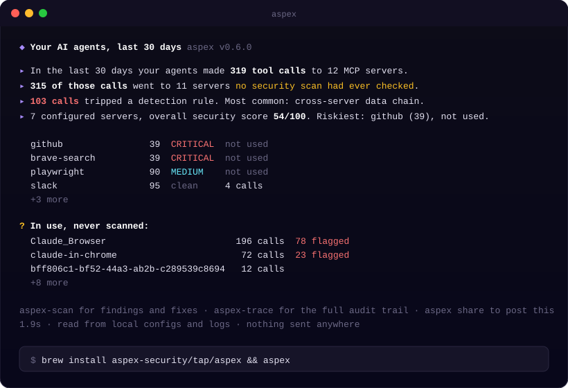

<div align="center">


# Aspex

### See what your AI agents actually did. Then scan what they could do.

**Your AI coding agent made hundreds of tool calls this month. Do you know where they went?**

[](LICENSE)
[](https://github.com/aspex-security/aspex/actions/workflows/ci.yml)
[](https://github.com/aspex-security/aspex)

```sh
brew install aspex-security/tap/aspex && aspex
```

**Offline. No account. One binary. Nothing leaves your machine. Ever.**



<sub>Real output from the maintainer's own machine, 1.9 seconds after typing <code>aspex</code>.</sub>

</div>

---

## Why this exists

Claude Code, Cursor, Windsurf and friends reach the world through **MCP servers** - programs that give the agent your filesystem, your GitHub, your database, your browser. Most people install them by pasting a config from a README.

Every MCP security tool so far answers one question: *what could this server do?* Aspex answers that too. But it started from the other one, the one nobody was answering:

**What did my agents actually do?**

Aspex reads the log files your AI clients already write. No proxy. No config change. It works on last month's sessions. Then it joins that with a static scan of every configured server, so you learn which risky servers are actually in use, and which servers your agents use that nothing has ever checked.

| | Tool | Question | How |
|---|---|---|---|
| **After** | `aspex-trace` | What did my agents do? | Reads native client logs. Reconstructs kill chains (credential read → outbound call), traces injected instructions back to their source. 85+ rules. |
| **Before** | `aspex-scan` | What can this server do? | Static analysis of every configured server. 140+ rules, 0-100 score, cross-server attack paths. |
| **Both** | `aspex` | Show me. | The snapshot above, then a menu. `aspex share` gives you a privacy-safe card to post. |

---

## Sixty seconds

```sh
aspex                    # what your agents did this month, then the menu
aspex share              # same headlines, no names or paths - paste it anywhere
aspex-trace killchain    # multi-step attack patterns in your agent sessions
aspex-scan               # audit every configured MCP server (7 servers in ~7s)
aspex-scan doctor        # 2-second pre-flight: leaked secrets, broad paths, plaintext HTTP
```

Works with Claude Code, Claude Desktop, Cursor, Windsurf, Cline, Roo-Cline, Continue, and Zed. Claude Code's user, project, and plugin scopes are all read.

---

## Make it yours

```sh
aspex-scan init                                  # .aspex.yaml: accept a risk with a reason, set your own severities
aspex-scan --save-baseline aspex-baseline.json   # snapshot today's findings...
aspex-scan --baseline aspex-baseline.json        # ...then fail only on NEW ones
aspex-scan --with-trace                          # rank risky servers by how much your agents actually use them
```

Accepted risks need a reason and can expire, so nothing is silently forgotten. [Policy guide](https://aspex.mintlify.site/guides/policy).

## CI

```yaml
- uses: aspex-security/aspex/.github/actions/aspex-scan-action@main
  with:
    fail-on: high
```

Reads `.aspex.yaml` and your baseline from the repo. Emits SARIF for GitHub Code Scanning. [CI guide](https://aspex.mintlify.site/guides/ci-integration).

---

## Why you can trust the rules

Detection is under contract. `testdata/corpus/` holds known-malicious servers that **must** trigger specific rules and popular real servers (the official filesystem, GitHub, Slack, fetch, Postgres servers) that **must not** be flagged above a stated severity. CI runs both on every change. The corpus found three real rule bugs the first time it ran, including flagging the official Slack server as code execution. That bug is gone and cannot come back.

Findings map to OWASP LLM Top 10, MITRE ATLAS, and CWE. [All 225+ rules](https://aspex.mintlify.site/reference/rules).

## What Aspex is not

- **Not a proxy.** It never sits in your agent's request path. Zero latency added.
- **Not a blocker.** It shows you. You decide.
- **Not a SaaS.** There is nothing to sign up for and no telemetry. The only network call is the download.
- **Not omniscient.** Connectors added through claude.ai live in the cloud and cannot be scanned statically. Aspex shows you how much of your activity runs through them instead of pretending they do not exist.

---

## Install

```sh
brew install aspex-security/tap/aspex                                                  # macOS / Linux
curl -fsSL https://raw.githubusercontent.com/aspex-security/aspex/main/install.sh | sh  # Linux / WSL
```

Or download a binary from [releases](https://github.com/aspex-security/aspex/releases). Every release ships SHA-256 checksums and an SPDX SBOM.

## Documentation

**[aspex.mintlify.site](https://aspex.mintlify.site)** - [aspex-trace](https://aspex.mintlify.site/tools/trace) · [aspex-scan](https://aspex.mintlify.site/tools/scan) · [policy & baselines](https://aspex.mintlify.site/guides/policy) · [daily workflow](https://aspex.mintlify.site/guides/daily-workflow) · [rules](https://aspex.mintlify.site/reference/rules)

## Contributing

The most valuable PR is a corpus fixture: a malicious pattern Aspex should catch, or a popular server it should leave alone. About 15 minutes. See [CONTRIBUTING.md](CONTRIBUTING.md).

Security issues: do not open a public issue. Email steven.d@onyx.security.

## License

Apache-2.0. Sponsored by [Onyx Security](https://onyx.security). Free forever, and it stays offline.
