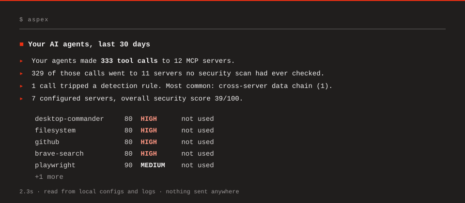

<div align="center">

# Aspex

### Know what your agents can do. Know what they actually did.

A local security debugger for AI agents. Offline, deterministic, one binary.

[](LICENSE)
[](https://github.com/aspex-security/aspex/actions/workflows/ci.yml)
[](https://aspex.mintlify.site/reference/rules)

```sh
brew install aspex-security/tap/aspex && aspex     # or: npx aspex
```



<sub>Real output from the maintainer's machine. 2.3 seconds, nothing sent anywhere.</sub>

</div>

## Why

Your coding agent reaches the world through MCP servers, skills and hooks. Each one looks fine alone. A filesystem server scoped to your home directory next to a browser server is a path from `~/.ssh` to any URL an injected instruction chooses. Aspex reasons about them **together**, from the configs and logs already on your machine.

No proxy. No LLM. No SaaS. Dependabot tells you when dependencies change; Aspex tells you when your agent's *capabilities* change.

## Five questions

| Question | Run | Outcome |
|---|---|---|
| **What CAN happen?** | `aspex scan` | Find dangerous combinations across your agent's tools and see the resulting blast radius. [Docs →](https://aspex.mintlify.site/tools/scan) |
| **What DID happen?** | `aspex trace` | Reconstruct what your agents actually did, from the logs they already write. [Docs →](https://aspex.mintlify.site/tools/trace) |
| **What CHANGED?** | `aspex diff main..HEAD` | See whether a code or config change added a capability or created a new attack path. [Docs →](https://aspex.mintlify.site/tools/change-detection) |
| **WHY does it matter?** | `aspex explain "…"` | Understand why a path exists, what evidence supports it, and what would break it. [Docs →](https://aspex.mintlify.site/tools/explain) |
| **WHAT IF I change it?** | `aspex simulate …` | Test a security change without modifying your real configuration. [Docs →](https://aspex.mintlify.site/tools/simulate) |

`aspex tighten` turns what your agents actually used into least-privilege allowlists, each with its simulated impact. `aspex inspect` shows what a server would add before you install it. Everything recommends; nothing edits your config.

## What a finding looks like

Every server below is an official, well-behaved package. The problem is the composition:

```
$ aspex scan

  CRITICAL  AP001  Potential sensitive data exfiltration path  confidence: high
     filesystem
       └─ read_file: reads files by path
       └─ allowed root /Users/steven (home directory: includes ~/.ssh, ~/.aws, browser profiles)
     playwright
       └─ browser_navigate: reaches network destinations (takes a URL parameter)

     Path
         instruction from a prompt, document, or tool result
       ↓ filesystem.read_file reads credential files such as ~/.ssh and ~/.aws
       ↓ contents enter the agent's context
       ↓ playwright.browser_navigate sends them to any network destination

     Fix
       scope filesystem to specific project directories instead of
       /Users/steven; constrain playwright to an allowlist of
       destinations. Either change alone removes the path.
```

Ask what removes it, then try the change without touching your config:

```
$ aspex simulate --restrict-filesystem filesystem=~/projects/acme

  BEFORE   blast radius HIGH   3 attack path(s)
  AFTER    blast radius MEDIUM 1 attack path(s)

  REMOVED ATTACK PATHS
     ✓ Potential sensitive data exfiltration path  CRITICAL · filesystem + playwright

  No configuration was modified.
```

Nothing here claims the path was walked; that is `aspex trace`'s job. [More real output: explain, simulate, diff, trace →](https://aspex.mintlify.site/quickstart)

## Try it in two minutes

```sh
git clone https://github.com/aspex-security/aspex && cd aspex
./examples/demo/run.sh
```

A deterministic fake environment (no real credentials, no servers launched, nothing sent anywhere) that walks the whole loop: a critical exfiltration path, `explain` naming the two controls, `simulate` removing them, and the recorded session where a README fetch precedes a credential read.


## Commit your agent security state

`.aspex.lock` is a reproducible security fingerprint of your agent environment: every server's identity and tool surface, capabilities, filesystem scope, hooks, skills, reachable resources and attack paths. It never contains secret values, only env-variable names, so it is safe to commit.

```sh
aspex lock            # writes .aspex.lock
git add .aspex.lock
aspex verify          # later, in CI: exit 1 when the environment drifts
```

A tool that quietly re-describes itself, a widened filesystem root, a new attack path: `verify` and `diff` explain the security meaning of the change, not just that a file changed. The format is an open, documented Aspex artifact other tooling can read. [Change detection →](https://aspex.mintlify.site/tools/change-detection)

## Why you can trust it

- **Offline.** No account, no telemetry. The only network call is the download.
- **Deterministic.** Two runs over the same state produce byte-identical output. Answers are computed from the capability graph, never generated.
- **Under contract.** `testdata/corpus/` holds malicious servers that **must** fire and popular real servers that **must not**. CI runs both on every change.
- **Honest about limits.** Not a proxy, not a blocker. Cloud connectors it cannot scan are shown as "in use, never scanned" rather than hidden.

## Install

```sh
brew install aspex-security/tap/aspex                                                  # macOS
npx aspex                                                                              # anywhere with Node
curl -fsSL https://raw.githubusercontent.com/aspex-security/aspex/main/install.sh | sh  # Linux / WSL
```

Or a static binary from [Releases](https://github.com/aspex-security/aspex/releases). Every release ships SHA-256 checksums and an SPDX SBOM.

## Docs

| | | |
|---|---|---|
| [**Quickstart**](https://aspex.mintlify.site/quickstart)<br><sub>First scan in a minute</sub> | [**How Aspex reasons**](https://aspex.mintlify.site/concepts/how-aspex-reasons)<br><sub>Capabilities, paths, confidence</sub> | [**CI integration**](https://aspex.mintlify.site/guides/ci-integration)<br><sub>Gate PRs on security drift</sub> |
| [**Common workflows**](https://aspex.mintlify.site/guides/common-workflows)<br><sub>Task first, command second</sub> | [**Rules**](https://aspex.mintlify.site/reference/rules)<br><sub>OWASP / ATLAS / CWE mapped</sub> | [**Let your agent ask Aspex**](https://aspex.mintlify.site/tools/mcp)<br><sub>Read-only MCP server</sub> |

Using a coding agent? The docs are available as [`llms.txt`](https://aspex.mintlify.site/llms.txt).

## Contributing

The most valuable PR is a corpus fixture: a malicious pattern Aspex should catch, or a popular server it should leave alone. About 15 minutes. See [CONTRIBUTING.md](CONTRIBUTING.md). Security issues: email steven.d@onyx.security, not a public issue.

Apache-2.0. Free forever, and it stays offline.
